# Detection algorithms on the Petri net

How each bug mode reads the **state graph** (or explores the net) and what net pattern counts as a hit.

Shared assumption: resource identity (same lock / loc / atomic) was already fixed when building the net. Detectors only look at markings and typed transitions.

Code: `src/detect/deadlock.rs`, `datarace.rs`, `atomicity_violation.rs`, `atomic_violation_detector.rs`.

## Overview

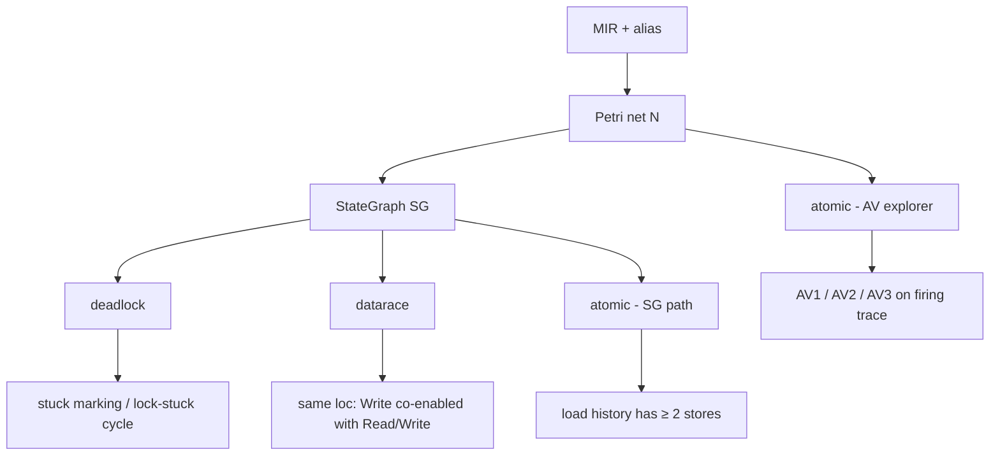

Bug pattern → what we look for on the net / SG:

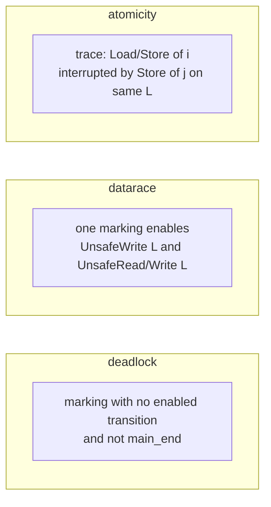

| Mode | Where | Bug ≅ |
| ---- | ----- | ----- |
| `deadlock` | SG | No enabled fire and not `main_end`, or stable cycle with locks stuck disabled |
| `datarace` | SG | Same loc: `UnsafeWrite` co-enabled with `UnsafeRead` / `UnsafeWrite` |
| `atomic` | SG or net trace | Interleaved Load/Store (AV*) or multi-store history before a load |
| `pointsto` | dump | no concurrency query |

Interesting `TransitionType`s: `Lock` / `Unlock` / `Wait` / `Notify`, `Spawn` / `Join`, `UnsafeRead` / `UnsafeWrite`, `AtomicLoad` / `AtomicStore` / `AtomicCmpXchg`.

---

## Deadlock (`--mode deadlock`)

**Input:** `StateGraph` → **Output:** `deadlock_report.txt`

### Pattern A — terminal non-exit marking (primary)

Report state `s` if it has **no outgoing edges** and is **not** normal exit (`main_end` has no token).

State-graph view:

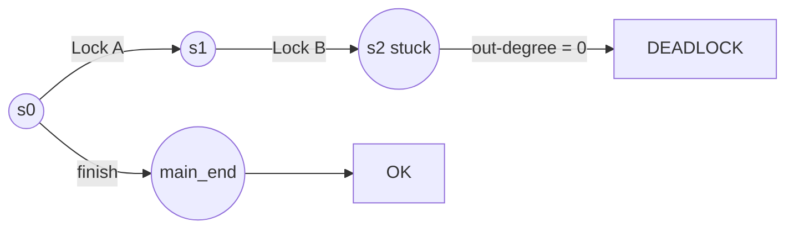

Net view of classic AB-BA (two threads, two mutexes):

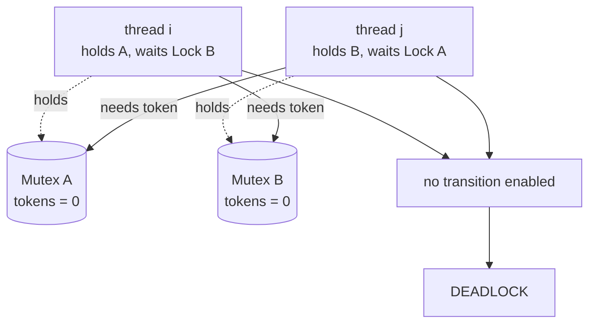

### Pattern B — cyclic wait with stuck locks (fallback)

If A finds nothing: a **stable cycle** where some (not all) locks stay disabled on every state.

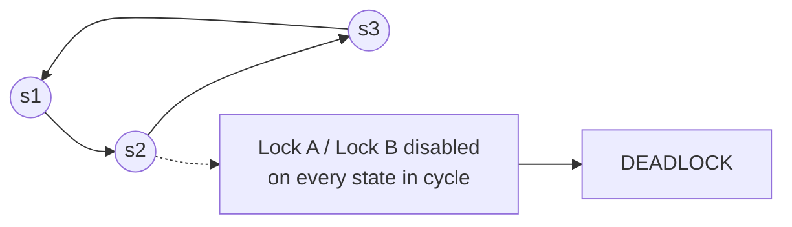

### Program → net

| Program bug | Net / SG situation |
| ----------- | ------------------ |
| AB-BA lock order | Pattern A: both wait, mutex tokens unavailable |
| Condvar wait without notify | `Wait` ret needs condvar token → A |
| Channel deadlock | send/recv blocked on channel place → A |

`dependency_deadlocks` is unused (empty stub).

---

## Data race (`--mode datarace`)

**Input:** `StateGraph` → **Output:** `datarace_report.txt`

### Pattern — conflicting unsafe accesses co-enabled

In one marking `s`: same `location_id`, ≥2 sites, pair is R/W or W/W (not R/R).

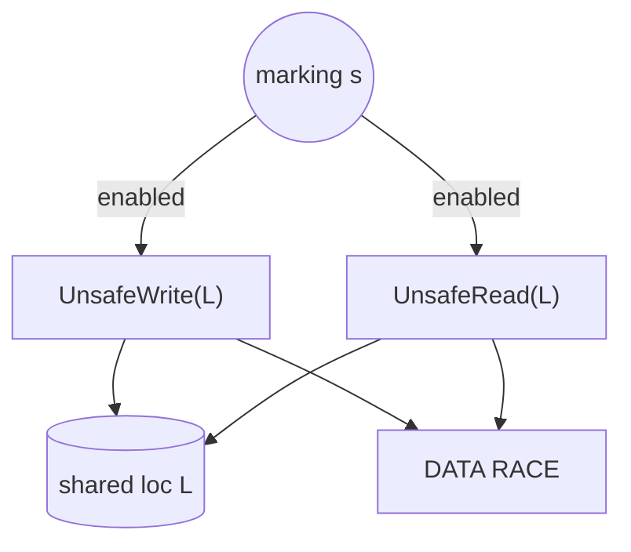

Write–write:

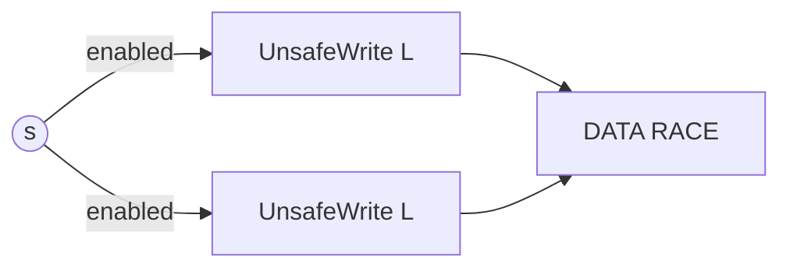

Contrast — serialized by a lock (not a race):

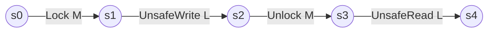

`UnsafeWrite` and `UnsafeRead` are never co-enabled in the same marking.

### Program → net

| Program bug | Net / SG situation |
| ----------- | ------------------ |
| Racy `*p` without sync | Both `Unsafe*`; same loc; some `s` enables both |
| Missing lock | No `Lock` between the two accesses |

Alias under-merge → FN. Over-merge → FP.

---

## Atomicity violation (`--mode atomic`)

| Build | Algorithm |
| ----- | --------- |
| default | SG heuristic (`AtomicityViolationDetector`) |
| `--features atomic-violation` | Net fire + AV1/2/3 (`detect_atomicity_violations`) |

### Feature path — AV patterns

Same atomic `L`, threads `i` ≠ `j`. A remote store breaks an interval of `i`:

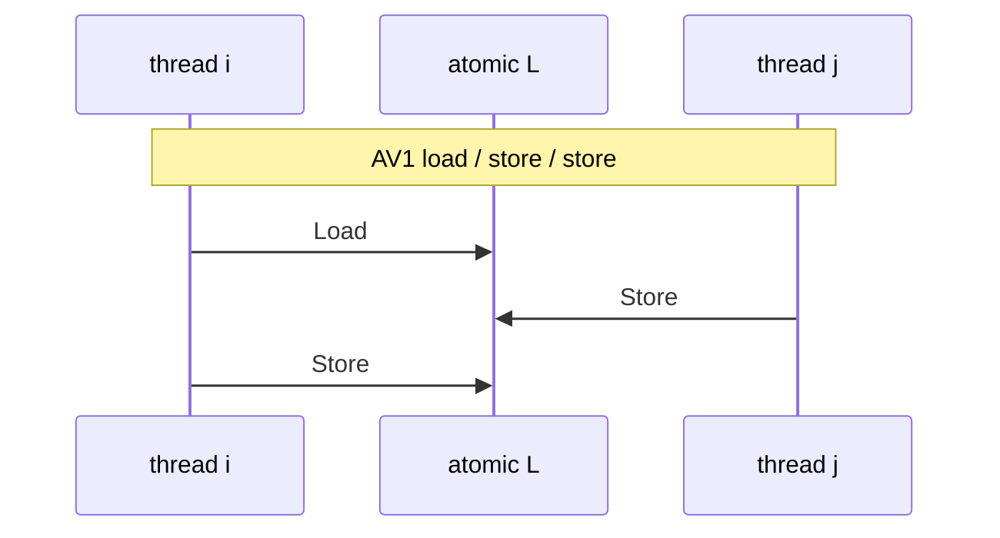

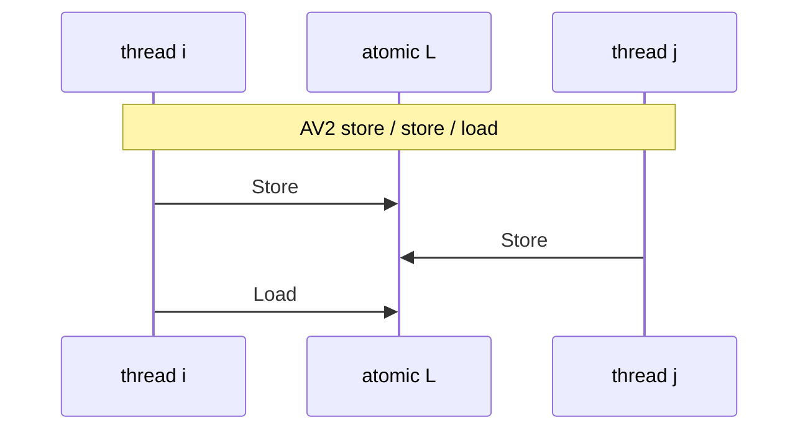

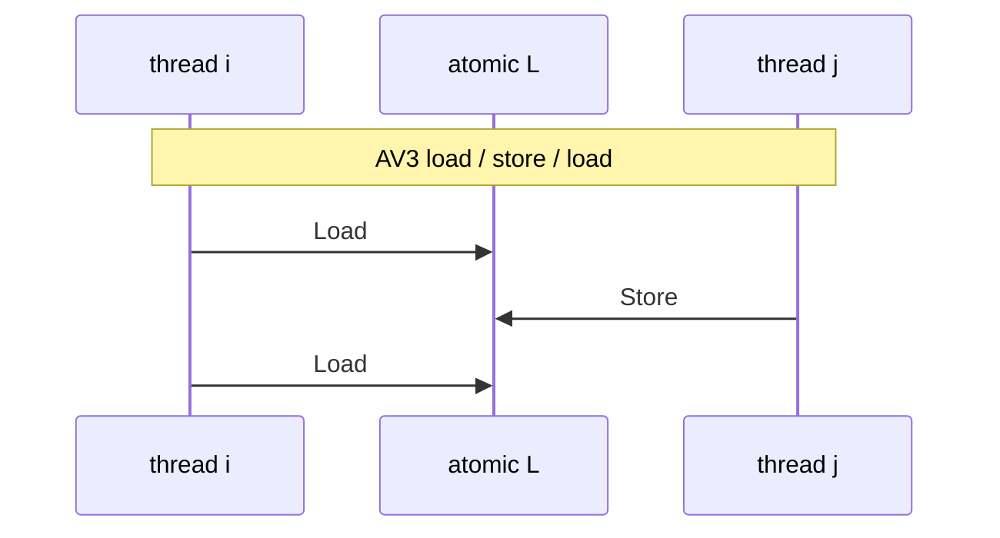

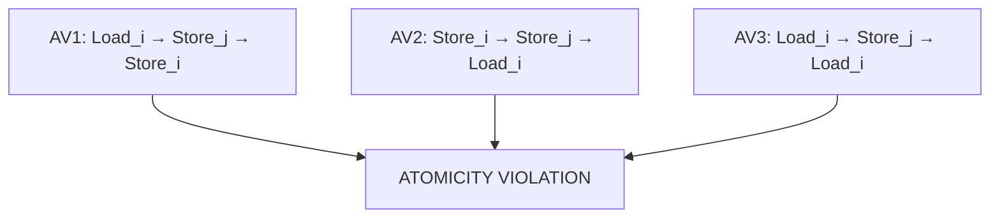

| Id | Shape | Meaning |
| -- | ----- | ------- |
| AV1 | Loadᵢ … Storeⱼ … Storeᵢ | Remote store before `i` stores after its load |
| AV2 | Storeᵢ … Storeⱼ … Loadᵢ | Remote store between `i`’s store and later load |
| AV3 | Loadᵢ … Storeⱼ … Loadᵢ | Remote store between two loads of `i` |

### Default path — load with ≥2 related stores in history

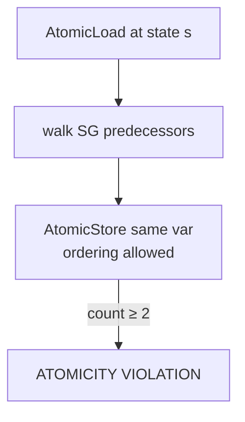

---

## What detectors do *not* decide

- Whether two guards are the same mutex (alias at construction).  
- Path feasibility / numeric branches.  
- Full memory-model HB (orders are tags / coarse filters only).
